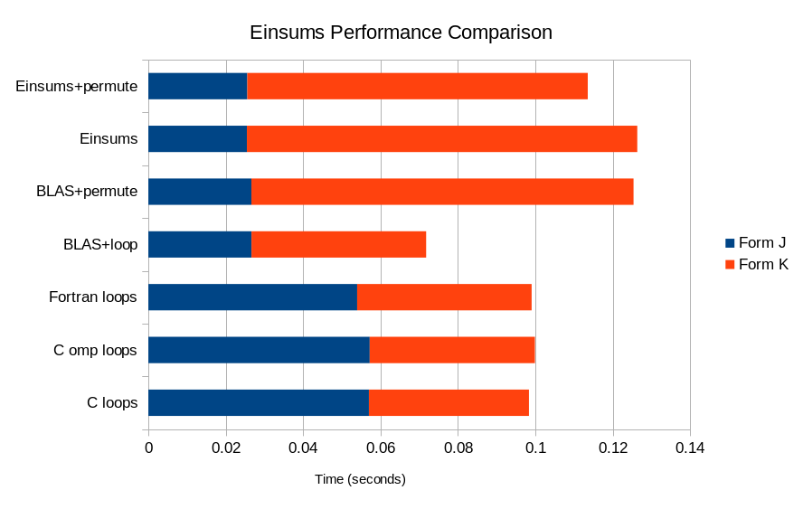
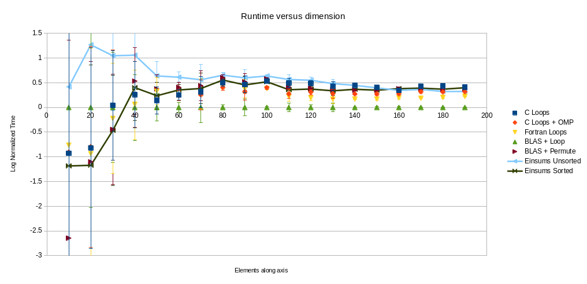

..
    ----------------------------------------------------------------------------------------------
     Copyright (c) The Einsums Developers. All rights reserved.
     Licensed under the MIT License. See LICENSE.txt in the project root for license information.
    ----------------------------------------------------------------------------------------------

.. _user:

##################
Einsums user guide
##################

This guide is an overview and explains the important features;
details are found in the reference. Follow the links below to find more information on the specific parts of Einsums.

.. toctree::
    :caption: Getting started
    :maxdepth: 1

    absolute_beginners
    python

.. toctree::
    :caption: User's Reference
    :maxdepth: 1

    /libs/overview
    ../reference/python_module

.. toctree::
    :caption: Extras

    ../license

============
Design Goals
============

The overall goal of Einsums is to allow scientists and mathematicians to write highly parallellized
code without needing to become a wizard in high-performance computing. Another goal is to have an
interface that mimics mathematical notation as closely as possible, so users don't necessarily
need to think about how to transform their equations into code. As an example, one might construct
the Einstein tensor using the following equation.

.. math::

    G_{\mu\nu} = R_{\mu\nu} - \frac{1}{2} R g_{\mu\nu}

This would become the following code using Einsums.

.. code:: C++

    Tensor<double, 2> ricci_tensor{"R", 4, 4}, metric_tensor{"g", 4, 4};
    double ricci_curvature;
    // Initializations of all of these.

    Tensor<double, 2> einstein_tensor{"G", 4, 4};
    einstein_tensor = ricci_tensor - 0.5 * ricci_curvature * metric_tensor;

Another example for a more general contraction is the coupled-cluster singles and doubles energy expression.
The governing equation is this.

.. math::
    
    E_{CCSD} = E_{HF} + \sum_{i}^{occ}\sum_{a}^{virt} F_{ia} t_{i}^{a} + 
    \frac{1}{4}\sum_{ij}^{occ} \sum_{ab}^{virt} \left<ij\middle|\middle| ab\right> \tau_{ij}^{ab}

    \tau_{ij}^{ab} = t_{ij}^{ab} + 2t_{i}^{a}t_{j}^{b}

    \left<pq \middle|\middle| rs \right> = \left<pq\middle|\middle|rs\right> - \left<pq\middle|\middle|sr\right>

This becomes the following code.

.. code:: C++

    double E_hf;
    int n_occ; // The number of occupied orbitals. 
    int n_orbs; // The number of orbitals.
    int n_virt = n_orbs - n_occ; // The number of virtual orbitals.
    Tensor<double, 2> F{"F", n_orbs, n_orbs}; // The Fock matrix.
    Tensor<double, 4> TEI{"G", n_orbs, n_orbs, n_orbs, n_orbs}; // The electron repulsion integrals.
    Tensor<double, 2> t1_amps{"T1", n_occ, n_virt};
    Tensor<double, 4> t2_amps{"T2", n_occ, n_occ, n_virt, n_virt};
    // Populate these values.

    double E_ccsd = E_hf;

    // Defining an intermediate.
    Tensor<double, 4> tau2{"tau2", n_occ, n_occ, n_virt, n_virt};
    tau2 = t2_amps;
    einsum(0.25, index::Indices{index::i, index::j, index::a, index::b}, &tau2, 0.5, index::Indices{index::i, index::a}, 
           t1_amps, index::Indices{index::j, index::b}, t1_amps);

    // Compute the antisymmetrized two-electron integrals.
    Tensor<double, 4> TEI_antisym = TEI;
    permute(1.0, index::Indices{index::p, index::q, index::r, index::s}, &TEI_antisym, -1.0, index::Indices{index::p, index::q, index::s, index::r} TEI);

    // Computing each term.
    TensorView<double, 2> Fia = F(Range{0, n_occ}, Range{n_occ, n_orbs});
    einsum(1.0, index::Indices{}, &E_ccsd, 1.0, index::Indices{index::i, index::a}, Fia, index::Indices{index::i, index::a}, t1_amps);

    TensorView<double, 4> TEI_ijab = TEI_antisym(Range{0, n_occ}, Range{0, n_occ}, Range{n_occ, n_orbs}, Range{n_occ, n_orbs});
    einsum(1.0, index::Indices{}, &E_ccsd, 1.0, index::Indices{index::i, index::j, index::a, index::b}, TEI_ijab, index::Indices{index::i, index::j, index::a, index::b}, tau2);

===================
Runtime Comparisons
===================

Einsums is an easy to use library that is also quite fast. To show this, we benchmarked the code for the following equation used in quantum chemistry against several
different methods.

.. math::

    J_{\mu\nu} = D_{\lambda\sigma}\left(\mu\nu\middle|\lambda\sigma\right)

.. math::

    K_{\mu\nu} = D_{\lambda\sigma}\left(\mu\lambda\middle|\nu\sigma\right)

.. math::

    G_{\mu\nu} = 2J_{\mu\nu} - K_{\mu\nu}

The code for the benchmarks can be found in `devtools/profiling` along with a spreadsheet containing the raw timings to update these images as we improve our algorithms.
The benchmark was performed on a system with the following specifications.

+-------------------------+------------------+------------------------+
| CPU                     | Model            | Intel Core i7-13700 K  |
|                         +------------------+------------------------+
|                         | Clock            | 3.4 GHz                |
|                         +------------------+------------------------+
|                         | Cache            | 30 MB                  |
|                         +------------------+------------------------+
|                         | Cores/Threads    | 16/24                  |
+-------------------------+------------------+------------------------+
| GPU                     | Model            | AMD Radeon RX 7900 XTX |
|                         +------------------+------------------------+
|                         | Memory           | 24 GB                  |
+-------------------------+------------------+------------------------+
| System                  | Memory           | 32 GB + 62 GB swap     |
|                         +------------------+------------------------+
|                         | Storage          | 2 TB NVME SSD storage  |
|                         +------------------+------------------------+
|                         | Operating System | Debian Bookworm 12.6   |
|                         +------------------+------------------------+
|                         | Einsums Version  | 1.0-pre                |
|                         +------------------+------------------------+
|                         | C++ Compiler     | Clang 19.7.1           |
|                         +------------------+------------------------+
|                         | Fortran Compiler | GCC Fortran 12.2.0     |
|                         +------------------+------------------------+
|                         | BLAS Vendor      | Netlib 3.9.0           |
+-------------------------+------------------+------------------------+

The tensor contraction was performed in several different ways: for loops in C; for loops in C with OpenMP SIMD vectorization and parallelization;
CONCURRENT DO loops in FORTRAN; BLAS gemv call for the J matrix and an explicit loop in C++ for the K matrix; BLAS gemv call for the J matrix, then
permuting the two-electron integrals to allow for a gemv call to be used for the K matrix; Einsums without permuting the two-electron integrals for
the K matrix; and Einsums with permutation of the two-electron integrals for the K matrix. This first image shows the breakdown of the timing for
building the individual matrices. The build time for the G matrix is not included as its contribution is too small to see.

As we can see, Einsums actually outperforms the BLAS package that it is based on. However, it doesn't come anywhere close to raw loops in C or FORTRAN,
which is expected. Modern FORTRAN is optimized for matrix and vector operations, so it would make sense for it to be fast. As for C, it lacks the overhead
of doing calculations in C++. But this also means it lacks the extensibility needed to perform general tensor contractions with a simple interface.
We can also show that this performance comparison is rather stable with respect to the sizes of the tensors.

.. image:: ../_static/index-images/Performance_comp.png
    :alt: Comparison of timings based on tensor size.

In the above image, we can see that Einsums stays below BLAS, but above C and FORTRAN. The Einsums timings are highlighted using lines connecting the data points.
Since it can be hard to see the values on the left side of the graph, an alternative view can be made. For this, the timings were divided by the time needed for the
normal for loops in C, then the natural logarithm of the result was taken. Error bars are given to show the uncertainty of the orderings when applicable.

As can be seen in these plots, the complexity of all of these operations seems to be similar. We would expect it to be about quartic.

============================
Capabilities and Limitations
============================

As of right now, Einsums is capable of the following:

* General contractions between two tensors of the form :math:`C_{ijk\cdots} = \alpha C_{ijk\cdots} + \beta A_{abc\cdots} B_{xyz\cdots}`.
* Generalized transpositions of the form :math:`C_{ijk\cdots} = \alpha C_{ijk\cdots} + \beta A_{abc\cdots}`.
* Linear algebra on tensors using BLAS and LAPACK as a backend.
* Taking advantage of tensor layout. If the tensor is block diagonal or has blocks of zeros, the :cpp:class:`BlockTensor` and :cpp:class:`TiledTensor`
  classes can parallellize certain operations.
* Mapping operations over all of a tensor's indices.
* Limited interaction with Python.
    * A form of the ``einsum`` call works in Python. All Einsums functions exposed to Python can also consume NumPy arrays.
* GPU acceleration for all of the above using HIP. Uses hipBLAS and hipSolver for the GPU linear algebra operations.
* Simple arithmetic between tensors. The tensors all need to have the same dimensions, though, and this does not yet work on GPU.
* Tensors representing functions of their indices.

The following is not supported, but may be supported in the future.

* When calling :cpp:func:`einsum`, there is no transposing of the indices. If a call can not be optimized without transpositions,
  it will use the generic algorithm rather than transpose indices until it can optimize the call.
* Most simple arithmetic does not work on :cpp:class:`BlockTensor`, :cpp:class:`TiledTensor`, :cpp:class:`FunctionTensor`,
  or any tensor for the GPU.
* The Python module does not have any exposed linear algebra routines. This will be fixed in the future.
* The Python module only supports contiguous tensors. It does not support block-sparse tensors, function tensors, or others.
* The Python module interacts with Einsums in a completely different way than C++. Be careful of pitfalls when working with
  interoperable code.
* Multi-node acceleration using MPI or similar.
* Tensors stored on disk are not fully fleshed out yet, and the interface is not yet stable.
